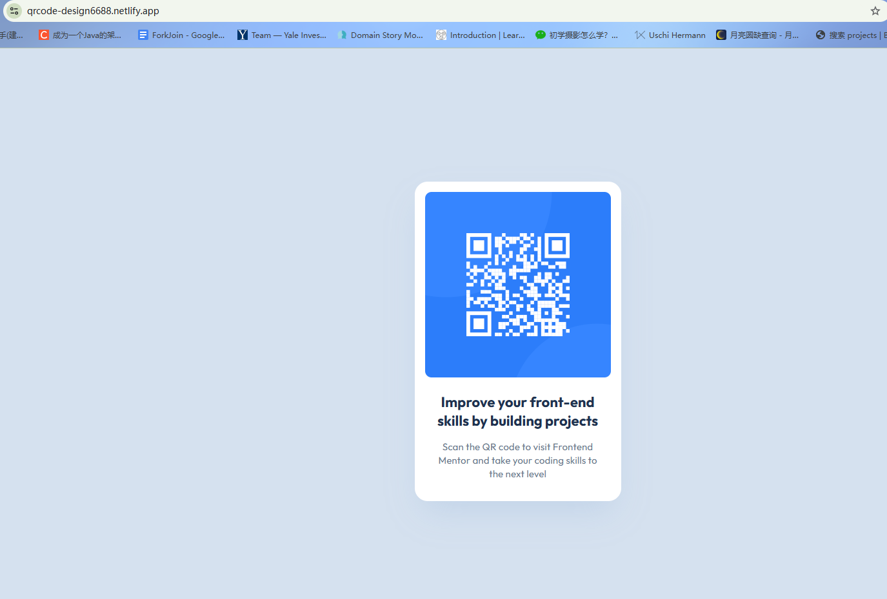

# Frontend Mentor - QR code component solution

This is a solution to the [QR code component challenge on Frontend Mentor](https://www.frontendmentor.io/challenges/qr-code-component-iux_sIO_H). Frontend Mentor challenges help you improve your coding skills by building realistic projects. 

## Table of contents

- [Overview](#overview)
  - [Screenshot](#screenshot)
  - [Links](#links)
- [My process](#my-process)
  - [Built with](#built-with)
  - [What I learned](#what-i-learned)
  - [Continued development](#continued-development)
  - [AI Collaboration](#ai-collaboration)
- [Author](#author)
- [Acknowledgments](#acknowledgments)

**Note: Delete this note and update the table of contents based on what sections you keep.**

## Overview

### Screenshot



Add a screenshot of your solution. The easiest way to do this is to use Firefox to view your project, right-click the page and select "Take a Screenshot". You can choose either a full-height screenshot or a cropped one based on how long the page is. If it's very long, it might be best to crop it.

Alternatively, you can use a tool like [FireShot](https://getfireshot.com/) to take the screenshot. FireShot has a free option, so you don't need to purchase it. 

Then crop/optimize/edit your image however you like, add it to your project, and update the file path in the image above.

**Note: Delete this note and the paragraphs above when you add your screenshot. If you prefer not to add a screenshot, feel free to remove this entire section.**

### Links

- Solution URL: [https://www.frontendmentor.io/solutions/qr-code-component-built-with-semantic-html-and-fluid-layout-yourid](https://www.frontendmentor.io/solutions/qr-code-component-built-with-semantic-html-and-fluid-layout-yourid) 
- Live Site URL: [https://qrcode-design6688.netlify.app/](https://qrcode-design6688.netlify.app/)

## My process

### Built with

- Semantic HTML5 markup
- CSS custom properties
- CSS Grid
- Mobile-first workflow

**Note: These are just examples. Delete this note and replace the list above with your own choices**

### What I learned

Use this section to recap over some of your major learnings while working through this project. Writing these out and providing code samples of areas you want to highlight is a great way to reinforce your own knowledge.

To see how you can add code snippets, see below:

```html
<!-- 第一层：视口容器（整个页面通常就这一个核心组件，可直接用 main） -->
<main class="card-container">

  <!-- 第二层：独立卡片主体（用 figure 表达这是一个独立的图文结合体） -->
  <figure class="qr-card">
    
    <!-- 第三层（独立子节点）：核心视觉元素 -->
    

    <!-- 第三层（独立子节点）：文本描述区域，用 figcaption 包裹更严谨 -->
    <figcaption class="qr-content">
      <h1 class="qr-title">Improve your front-end skills by building projects</h1>
      <p class="qr-description">Scan the QR code to visit Frontend Mentor and take your coding skills to the next level</p>
    </figcaption>

  </figure>

</main>
```
```css
    .card-container {
        min-height: 100vh;
        display: grid;
        place-items: center; /* Efficient one-line vertical and horizontal centering */
        padding: 24px; 
    }

    .qr-card {
        background-color: var(--color-card-bg);
        width: 100%;
        max-width: 320px; 
        padding: 16px;
        border-radius: 20px;
        box-shadow: 0 25px 50px -12px rgba(131, 166, 210, 0.25);
    }
```


### Continued development

In future Frontend Mentor challenges, I plan to build upon these foundations by focusing on:

- Handling more complex multi-column responsive layouts using advanced CSS Flexbox and Grid alignments.

- Implementing strict BEM (Block Element Modifier) naming conventions to manage scaling stylesheets.

- Diving into interactive JavaScript logic for component state management.


### AI Collaboration

I leveraged AI-assisted development practices to refine the engineering decisions behind this build:

- Tools Used: Gemini

- Workflow Integration: Brainstormed semantic layout alternatives during the initial wireframing phase, which led to replacing generic div soup with a clean figure/figcaption hierarchy.

- Key Takeaway: The assistant was highly effective for architectural code reviews and fine-tuning subtle design tokens, such as establishing a proper border-radius hierarchy between the inner image and the outer container.


## Author

- GitHub - [@yun900800](https://github.com/yun900800/qr-code-component)
- Frontend Mentor - [@yun900800](https://www.frontendmentor.io/profile/yun900800)


